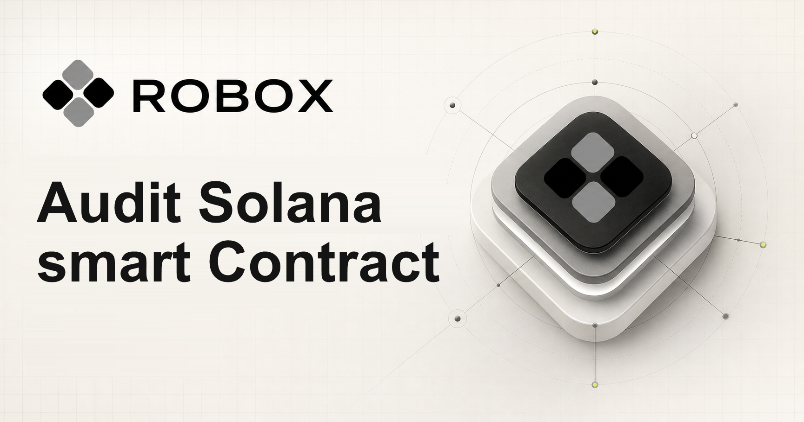

# Audit Solana smart Contract

## Introduction

Robox is a Rust-native security auditor for Solana programs. Point it at an Anchor or native Solana project — a local folder, browser-uploaded source files, or a public GitHub repository — and it parses the Rust source, classifies the program, runs deterministic security rules, and maps how instructions, accounts, PDAs, CPIs, and token flows relate to each other. Every finding is explainable and pinned to an exact code location, so you can review it like an auditor would rather than trusting an opaque score.

You can use it three ways: a web dashboard for interactive review, a CLI for local scans and CI gates, and a REST/WebSocket API for integration. Audit results export as terminal output, detailed PDF, JSON, Markdown, or SARIF 2.1.0, so the same scan can feed a human review, a report handed to a team, or a GitHub code-scanning pipeline.

# Robox

Robox is a Rust-native security analysis foundation for Solana and Anchor programs. It scans local projects, browser-uploaded source files, and public GitHub repositories; returns explainable findings with exact code locations; and exports terminal, detailed PDF, JSON, Markdown, and SARIF 2.1.0 reports. The dashboard starts empty and never displays a score or finding until an imported project has completed a live scan.

This repository is intentionally honest about scope. Version `0.1.0` implements Solana-aware project discovery with `syn`, Anchor/native-program classification, eleven deterministic security rules, Solana metrics, a lightweight instruction/account/PDA/CPI/token relationship graph, queued scan orchestration, report generation, a CLI, and REST/WebSocket access. It does **not** claim compiler-quality CFG/DFG, symbolic execution, runtime simulation, or AI reasoning. Those capabilities have documented extension seams.

## What is included

- `robox-core`: source loading, Rust AST parsing, Anchor/native Solana detection, project metrics, relationship graph, rule registry, score calculation
- `robox-report`: detailed multi-page PDF, JSON, Markdown, and GitHub-compatible SARIF 2.1.0
- `robox-cli`: local and CI-friendly scanning with score thresholds
- `robox-api`: Axum REST API, queued scans with progress, WebSocket stream, history, rule discovery, inline folder scanning, and restricted public-GitHub cloning
- `apps/web`: polished Next.js 16 dashboard with folder/GitHub import, branch selection, live progress, reviewable findings, real graph data, backend reports, CI setup, and a custom-rule workspace
- `examples/vulnerable-anchor`: safe local fixture containing five deliberate review findings
- `.github/workflows/robox.yml`: SARIF CI example

## Quick start

Requirements: Rust stable, Node.js 22+, npm, and Git.

On Windows:

```powershell
cd D:\robooxx
.\scripts\setup.ps1
.\scripts\dev.ps1
```

On macOS or Linux:

```bash
cd /path/to/robooxx
./scripts/setup.sh
./scripts/dev.sh
```

Open `http://127.0.0.1:3000`. The Rust API listens on `http://127.0.0.1:8080`. Choose an Anchor/Rust project folder, or enter a public `https://github.com/owner/repository` URL and optional branch. Findings, metrics, graphs, and reports appear only after that live scan completes.

## CLI

```powershell
cargo run -p robox-cli -- scan examples/vulnerable-anchor
cargo run -p robox-cli -- scan path/to/anchor-project --format json --output report.json
cargo run -p robox-cli -- scan path/to/anchor-project --format markdown --output report.md
cargo run -p robox-cli -- scan path/to/anchor-project --format sarif --output report.sarif
cargo run -p robox-cli -- scan path/to/anchor-project --format pdf --output audit.pdf
cargo run -p robox-cli -- scan path/to/anchor-project --fail-on-score-below 70
```

Exit code `2` is used when `--fail-on-score-below` is configured and the score misses the threshold.

## API surface

| Method | Endpoint | Purpose |
| --- | --- | --- |
| `GET` | `/health` | Service health |
| `GET` | `/api/v1/rules` | List active rule metadata |
| `GET` | `/api/v1/scans` | List completed scans for this process |
| `POST` | `/api/v1/scans` | Run a synchronous local, inline, or GitHub scan |
| `GET` | `/api/v1/scans/{id}` | Retrieve a completed scan |
| `GET` | `/api/v1/scans/{id}/report/{pdf|json|sarif|markdown}` | Export a report |
| `POST` | `/api/v1/jobs` | Start an asynchronous scan job |
| `GET` | `/api/v1/jobs/{id}` | Read job stage, progress, error, or result |
| `GET` | `/api/v1/ws/{job-id}` | Stream scan-job progress over WebSocket |

Inline scan example:

```json
{
  "project": "vault",
  "source": {
    "type": "inline",
    "files": [
      { "path": "programs/vault/src/lib.rs", "content": "use anchor_lang::prelude::*;" }
    ]
  }
}
```

GitHub input is restricted to canonical HTTPS repository URLs and shallow clones. Private-repository credentials are deliberately not accepted by the MVP.

## Verification

```powershell
cargo fmt --all -- --check
cargo test --workspace
cd apps/web
npm run lint
npm run build
npm run test:e2e
```

The generated demo artifacts are in `reports/`. See [Architecture](docs/architecture.md) and [Rule authoring](docs/rules.md) for extension guidance.

## Security model

Robox findings are review candidates, not proof that a program is vulnerable or secure. Production hardening should add sandboxed repository isolation, authentication and authorization, durable scan storage, rate and size limits, signed plugin distribution, and independent manual audit coverage.

Licensed under Apache-2.0.

---

## Documentation

Beyond this README, the repository ships in-depth guides for the pieces that matter most when you extend or deploy Robox:

- **[Architecture](docs/architecture.md)** — current data flow (with a Mermaid diagram), crate boundaries for `robox-core`, `robox-report`, `robox-api`, and `robox-cli`, the documented extension seams (rules, compiler analysis, symbolic execution, AI review, plugins, persistence, queueing), and a production hardening checklist.
- **[Rule authoring](docs/rules.md)** — how to implement a `Rule`, register it with the `RuleRegistry`, and ship a custom rule that runs deterministically and reports findings pinned to exact code locations.

## About Robox

Robox is a **Rust-native security auditor for Solana programs**, built to give auditors explainable, location-pinned findings instead of opaque scores. It works on Anchor and native Solana projects supplied from a local folder, browser-uploaded source files, or a public GitHub repository.

Key ideas behind the project:

- **Deterministic, reviewable rules.** The `0.1.0` release ships eleven security rules plus Solana-aware project discovery, metrics, and an instruction/account/PDA/CPI/token relationship graph. Findings are candidates for review, never proof of security.
- **Honest scope.** Robox deliberately does not claim compiler-quality CFG/DFG, symbolic execution, runtime simulation, or AI reasoning. Those capabilities are left as documented extension seams so the foundation stays trustworthy.
- **Multiple surfaces, one engine.** The same `robox-core` scan powers a Next.js web dashboard, a CI-friendly CLI with score thresholds, and a REST/WebSocket API, with reports exportable to terminal, PDF, JSON, Markdown, and SARIF 2.1.0.

If you are planning to contribute rules, analysis backends, or production hardening, start with the two docs above — they capture the boundaries and extension points the codebase relies on.
