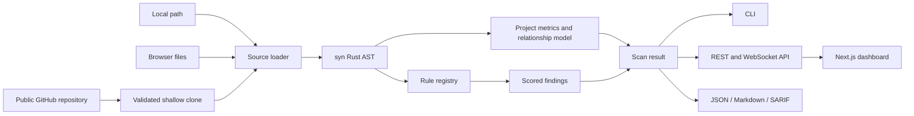

# Architecture

## Current data flow

Security-critical analysis and orchestration are implemented in Rust. The web app is a presentation and input layer; it does not decide whether a finding exists.

## Crate boundaries

`robox-core` owns stable domain types and deterministic analysis. `ScanEngine` accepts directory or inline sources, parses Rust files with `syn`, collects metrics and relationship nodes, runs a `RuleRegistry`, and computes a transparent score.

`robox-report` is a pure projection layer. It accepts a `ScanResult` and cannot mutate or reclassify findings.

`robox-api` owns transport concerns. GitHub cloning is constrained to public canonical HTTPS URLs. Completed scans use in-memory storage for the MVP.

`robox-cli` is the CI surface. It supports machine-readable formats and an explicit score gate.

## Extension seams

- **Rules:** implement `Rule` and register it with `RuleRegistry`.
- **Compiler analysis:** introduce an `AnalysisProvider` that enriches the project model with rust-analyzer or rustc-derived call, control-flow, and data-flow edges. Do not label syntax adjacency as CFG/DFG.
- **Symbolic execution:** consume a validated MIR-like intermediate representation behind a bounded execution service.
- **AI review:** use a provider adapter that receives evidence packages, never raw credentials. AI output should be separately attributed, confidence-scored, and prohibited from silently changing deterministic severity.
- **Plugins:** the current registry is compile-time and memory-safe. A production plugin system should prefer WASI components with capability restrictions, versioned schemas, time/memory limits, and signed distribution over native dynamic libraries.
- **Persistence:** replace the in-memory scan map with a repository trait backed by PostgreSQL or object storage.
- **Queueing:** move clone and scan work to isolated workers and make POST `/scans` asynchronous for large repositories.

## Production hardening checklist

1. Run every untrusted repository in a network-restricted, read-only sandbox with CPU, memory, file-count, and wall-clock limits.
2. Add workspace authentication, per-project authorization, audit logs, and encrypted provider secrets.
3. Enforce upload size, file type, decompression, path traversal, and repository host policies.
4. Pin and audit dependencies; sign release binaries and rule bundles.
5. Store immutable scan inputs and detector versions for reproducible results.
6. Add integration tests against representative Anchor versions and a labeled vulnerability corpus.

